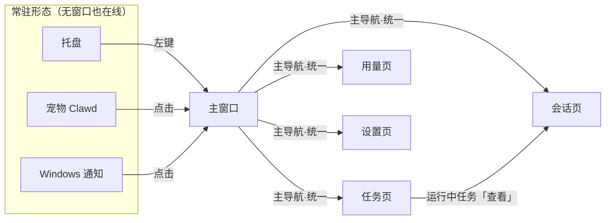
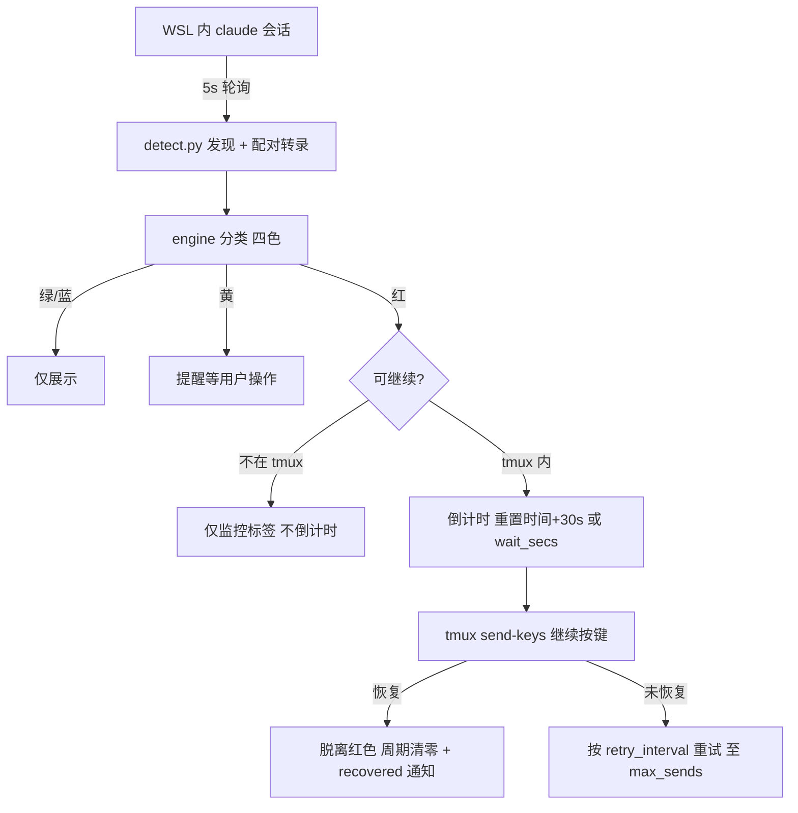
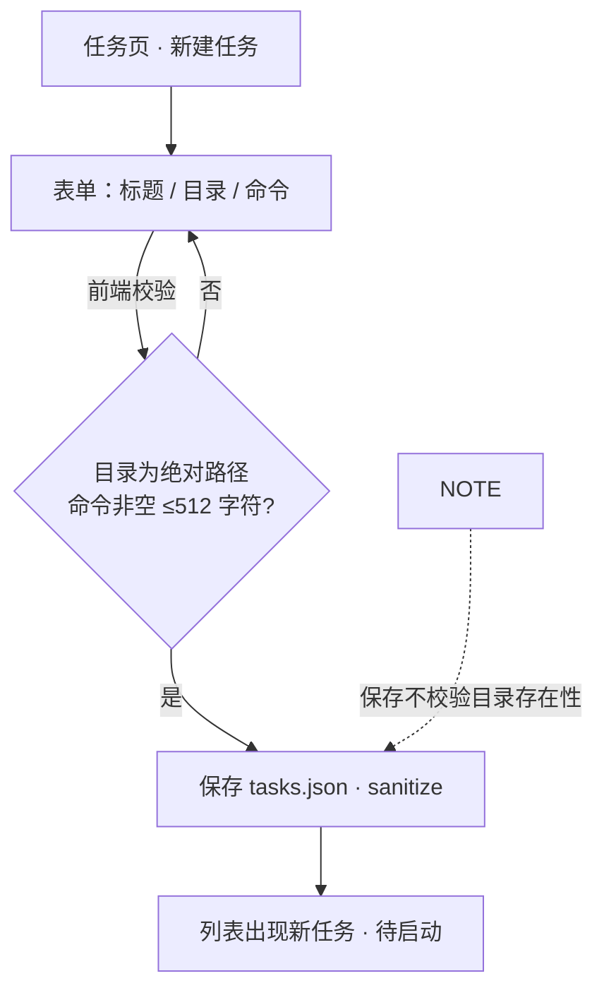
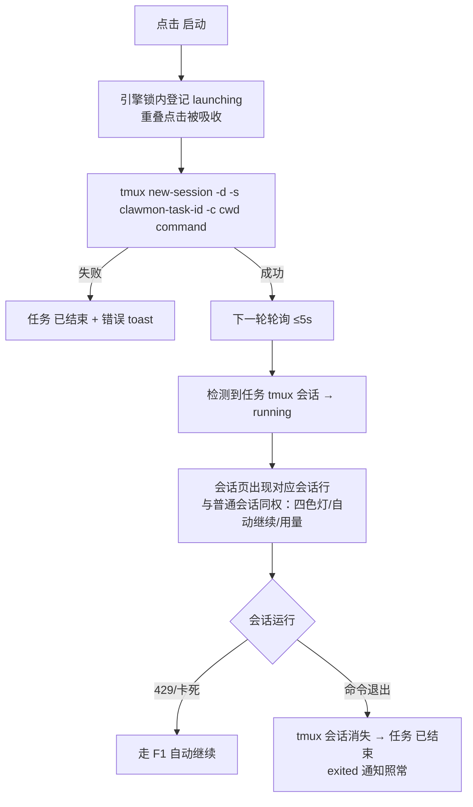
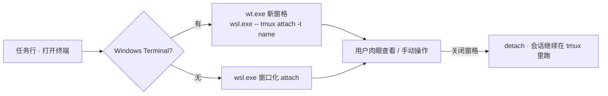
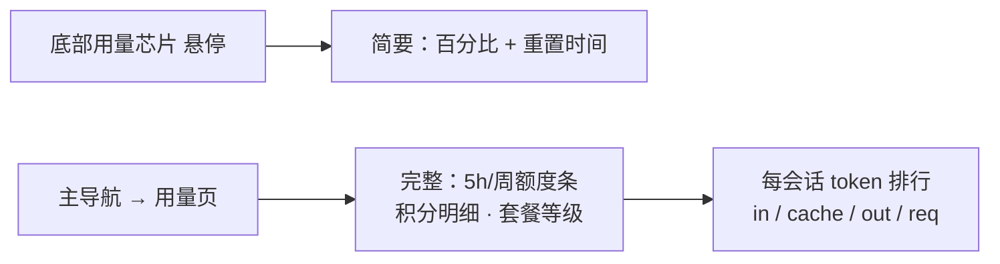
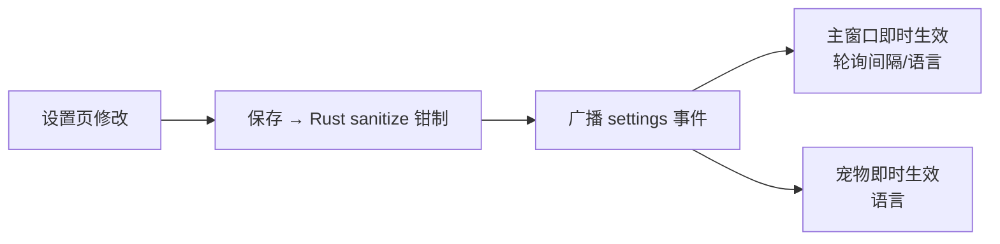

# clawmon 用户流程与页面导航（v2 设计）

| 项目 | 内容 |
|------|------|
| 版本 | 1.0 · 2026-09-25 |
| 关联 | [PRD](../prd.md) §FR5.2/FR10 · [屏幕规划](screen-plans.md) |
| 图表 | Mermaid |

---

## 1. 信息架构：页面导航关系

**导航不变量（硬性，来自用户约束 1）**：

1. 主导航栏固定在顶栏正下方，四项「会话 / 任务 / 用量 / 设置」，
   所有页面同一位置、同一次序、同一行为；
2. 导航栏由共享骨架渲染（原型 `_shared/layout.js`；产品中为 app.js 同层），
   页面代码**不得**增删导航项或改写其位置；
3. 仅高亮态随当前页变化；导航徽章（如红灯数）可全局刷新；
4. 最小窗宽 340px：四项等分，不换行、不横向滚动。

## 2. F1 监控闭环（v0.x 已有，v2 保持不变）

关键不变量：发送前锁内记账（FR3.4）；不确定状态永不红（FR2）。

## 3. F2 新建任务（v2 新增）

设计决策：**保存宽松、启动严格**——目录可以先建好任务再创建；
真正执行时才暴露路径错误（任务转「已结束」+ toast 提示）。

## 4. F3 启动任务 → 监控接管（v2 核心流程）

## 5. F4 打开终端（人工接管，可选）

要点：终端进程与 clawmon 解耦（无 CREATE_NO_WINDOW、独立进程）；
关闭终端 = detach，任务不中断；监控**不依赖**此按钮。

## 6. F5 查看用量

数据每 5 分钟由独立线程刷新；失败保留上次值；仅展示，永不参与分类。

## 7. F6 设置变更

## 8. 页面 ↔ 流程矩阵

| 页面 | 承载流程 | 页面内主动作 | 空态 |
|------|----------|--------------|------|
| 会话 | F1 | 立即继续（红）、跳转任务（任务会话） | 「没有发现 claude 会话」+ tmux 使用提示 |
| 任务 | F2 F3 F4 | 新建、启动、打开终端、停止、编辑、删除 | 「任务清单为空」+ 新建引导 |
| 用量 | F5 | 悬停明细（无跳转） | 「未配置 GLM 端点或已关闭」 |
| 设置 | F6 | 保存 / 还原 | —（表单常驻） |
